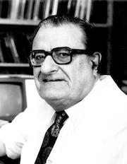
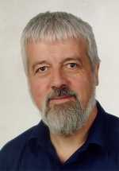
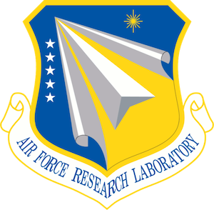
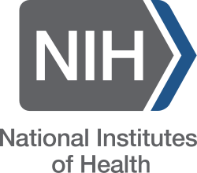
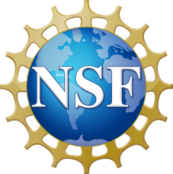

MOPAC's history spans over five decades of basic research and software development, and semiempirical quantum chemistry itself is almost a century old.
The history of MOPAC can be separated into four distinct eras following a prehistory of foundational development.
All of the publicly available source code and manuals for historical version of MOPAC are available in a [GitHub archive](https://github.com/openmopac/mopac-archive).

## Prehistory

The origin of semiempirical quantum chemistry is generally considered to be [Huckel's](https://doi.org/10.1007/BF01341936) simple, non-interacting
model of pi electrons in planar hydrocarbons from 1932.
Early calculations based on this model were done by hand, and the development of electronic computers eventually
motivated the development of more sophisticated models that were not tractable to calculate by hand.
The first notable advancement in the computer era was the Pariser-Parr-Pople (PPP) model that expanded Huckel's model to include Coulomb interactions
between electron, which was independently developed by [Pople](https://doi.org/10.1039/TF9534901375) and a collaboration
between [Pariser and Parr](https://doi.org/10.1063/1.1698929) in 1953.
The second notable advancement in 1963 was [Hoffman's](https://doi.org/10.1063/1.1734456) more general non-interacting model of hydrocarbons
that included both pi and sigma orbitals.
Pople went on to combine these advancements into the [complete neglect of differential overlap (CNDO) model](https://doi.org/10.1063/1.1701475) in 1965
that included both Coulomb interactions and a minimal, complete set of valence orbitals.
The CNDO model was then [parameterized to fit a variety experimental data](https://doi.org/10.1063/1.1701476), becoming the first of many general-purpose
semiempirical models for organic chemistry.

As computers continued to increase in power, the majority of activity in quantum chemistry method development shifted from semiempirical models to
*ab initio* calculations that were more predictive but more expensive.
There were only two centers of continued activity in semiempirical quantum chemistry through the 1970's that would go on to produce models and software with widespread use:
Zerner's development of the [ZINDO](https://doi.org/10.1007/BF00528484) model for spectroscopy, and Dewar's development of thermochemistry models
such as [MINDO/3](https://doi.org/10.1021/ja00839a001) and [MNDO](https://doi.org/10.1021/ja00457a004).
[Michael Dewar](https://en.wikipedia.org/wiki/Michael_J._S._Dewar)'s research group at the University of Texas at Austin actively
developed semiempirical thermochemistry models from 1963 to 1989,
and much of the theory and software produced by that activity formed the foundation of MOPAC.

The most important contributor to the theoretical foundation of MOPAC was [Walter Thiel](https://en.wikipedia.org/wiki/Walter_Thiel_(chemist)),
who was a post-doctoral scholar in the Dewar group from 1973 to 1975.
Thiel developed the modified neglect of diatomic overlap (MNDO) approximation and semiempirical model family that most of MOPAC's functionality is based on.
The original version of the MNDO model form only described s and p orbitals, and Thiel would go on to develop the [MNDO/d model form](https://doi.org/10.1007/BF01134863)
in 1992, which included d orbitals. MNDO/d was then incorporated into MOPAC in the late 1990's and used in the further development of the PM*x* model family.

## Austin era

The development of MOPAC began in 1981 after [James "Jimmy" Stewart](stewart_bio/) joined the Dewar group as a visiting scholar.
Stewart was a professor at the University of Strathclyde in Scotland with a lot of prior software development experience in quantum chemistry.
He was tasked by Dewar to refactor the research software that his group had produced during the development of the MINDO/3 and MNDO models into
a unified, user-friendly computer program. The first release of MOPAC was in 1983 as software available by mail order from the [Quantum Chemistry Program 
Exchange](https://en.wikipedia.org/wiki/Quantum_Chemistry_Program_Exchange) (QCPE). After GAUSSIAN became commercial software and was removed
from the QCPE catalog, MOPAC became the most popular software on the QCPE.

The Dewar group also simultaneously developed the Austin Model 1 (AM1) semiempirical model alongside MOPAC, which included the development of 
new model parameterization software. Stewart also contributed to the development of AM1 and its parameterization software, which he would eventually release as the PARAM
computer program. The [release paper](https://doi.org/10.1021/ja00299a024) for the AM1 model in 1985 would go on to be
[one of the most cited scientific papers of its time](https://doi.org/10.1038/514550a).

AM1 also caused a notable disagreement that led to a fork in software and model development. Dewar approached semiempirical model development as an
iterative constraint satisfaction problem where parameters were tuned to correct perceived deficiencies as a model was tested by hand, but parameter
changes sometimes caused problems in prior tests and prevented this iterative process from converging. Stewart approached semiempirical model development as
an optimization problem whereby parameters were tuned to minimize a global error metric that incorporated all tests simultaneously. This optimization process
was able to converge with some regularization, but sometimes a smaller error metric did not coincide with minimizing the number of perceived model deficiencies.
Ultimately, a combination of both approaches was used to develop AM1. AM1 was include in the second release of MOPAC, while Stewart continued the
optimization-based approach in the development of the [PM3 model](https://doi.org/10.1002/jcc.540100209) and subsequent models in the PM*x* family.
A version of MOPAC with AM1 was then forked into AMPAC, which was used in further semiempirical model development by the Dewar group.
In 1984, Stewart moved from the Dewar group at UT Austin to the Frank J. Seiler Research Laboratory of the Air Force Academy in Colorado Springs,
and he continued to develop MOPAC there until 1991.

In addition to being widely used, MOPAC received numerous contributions of new features in its early years that usually coincided with a research paper from the contributor.
There is a [summary](https://github.com/openmopac/mopac/blob/main/AUTHORS.rst) of MOPAC contributors and their contributed features in MOPAC's GitHub repository.

The research of the Dewar group in this era, including the development of semiempirical models and MOPAC, was primarily and continuously supported by the
Air Force Office of Scientific Research (AFOSR) of the Air Force Research Laboratory (AFRL), including grants AF-AFOSR-528-64, AF-AFOSR-1050-67,
AF-AFOSR-70-1S81, AFOSR-75-2749, AFOSR-79-0008, AFOSR-49620-83-C-0024, and AFOSR-86-0022.

## Fujitsu era

In the 1990's, both MOPAC and AMPAC turned to commercial distribution to support continued software development.
Stewart founded a sole proprietorship, Stewart Computational Chemistry, in 1991, and several former members of
the Dewar group founded the company [Semichem Inc.](http://www.semichem.com) in 1992 for commercial development and distribution of AMPAC.

As part of a broader investment in atomistic simulation software, Fujitsu hired Stewart as a consultant and acquired the distribution rights to future versions of MOPAC.
The first Fujitsu commercial release of MOPAC was MOPAC 93 in 1993. Fujitsu later acquired the CAChe software from Oxford Molecular Group in 2000 around the time of that
company's bankruptcy and liquidation, and MOPAC and CAChe formed the foundation for Fujitsu's SCIGRESS software. MOPAC was adapted into the MO-G simulation engine of
SCIGRESS and its development continued at FQS Poland subsidiary of Fujitsu. Some Fujitsu-exclusive semiempirical quantum chemistry features include the PM5 model and the
[LocalSCF](https://doi.org/10.1063/1.1764496) fast solver algorithm, which is technically distinct from MOPAC's 
[MOZYME](https://doi.org/10.1002/(SICI)1097-461X(1996)58:2%3C133::AID-QUA2%3E3.0.CO;2-Z) fast solver algorithm.

## Independent era

Stewart stopped working for Fujitsu in 2004 and distributed subsequent versions of MOPAC through Stewart Computational Chemistry
in partnership with third-party commercial resellers.
Versions of MOPAC from this era were free for academic use, but it required a commercial license for government and industrial use. MOPAC's model coverage of the periodic table was
greatly expanded to include the first 83 elements of the periodic table (with the lanthanides being modeled only in the +3 valence as classical "sparkles") in the
[PM6](https://doi.org/10.1007/s00894-007-0233-4) and [PM7](https://doi.org/10.1007/s00894-012-1667-x) models. MOPAC's support for biomolecular simulation, particularly of protein 
structures from the [Protein Data Bank](https://www.rcsb.org) (PDB), was also improved.

During this era, the development of MOPAC was supported by a combination of commercial sales and [several grants](https://www.sbir.gov/portfolio/318133)
from the National Institutes of Health (NIH) through its Small Business Innovation Research (SBIR) program.

For a more detailed history of MOPAC software development during this era, see the pre-git [maintenance record](/Maintenance.html).
For a summary of Stewart-authored publications related to MOPAC development after 2015, see the [publication list](/Manual/Publications.html) from the online MOPAC manual.

## MolSSI era

In 2019, Stewart began a partnership with the Molecular Science Software Institute (MolSSI) to migrate MOPAC into an open-source software project.
On the technical side, this process involved improving the portability of MOPAC's code base, reorganizing its to be easier to understand and contribute to,
adapting its building, testing, and distribution to the modern open-source ecosystem, fixing some performance issues, and adding new interfaces to improve accessibility.
On the social side, this involved contacting and coordinating with various stakeholders and collecting essential institutional knowledge.
This process concluded in 2022 with a legal transfer of MOPAC's intellectual property to Virginia Tech and its first open-source release.
Stewart continued to be actively involved in MOPAC development until 2025, when he finally finished up all of his planned scientific work and retired.
MolSSI's work with MOPAC has been led by Jonathan Moussa, who has also assumed responsibility for MOPAC's long-term support and maintenance.

MolSSI, including its work with MOPAC, has been supported by the National Science Foundation (NSF) through grants ACI-1547580 and CHE-2136142.
